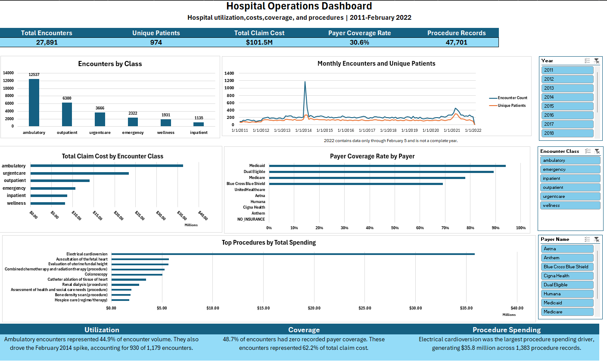
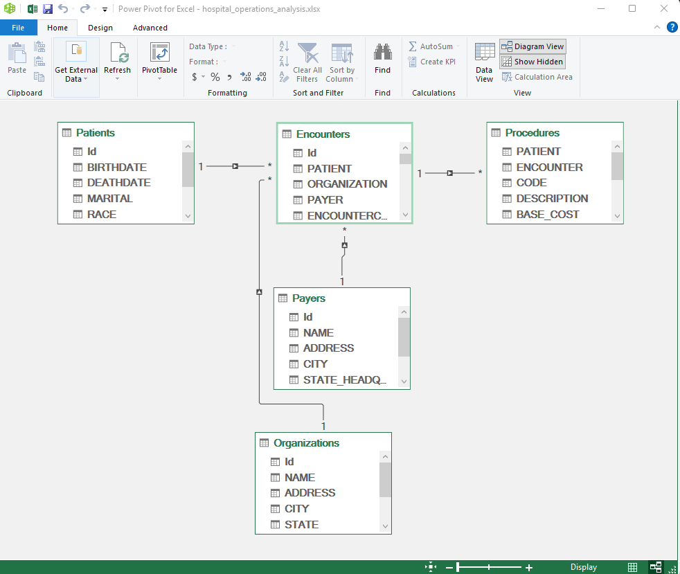
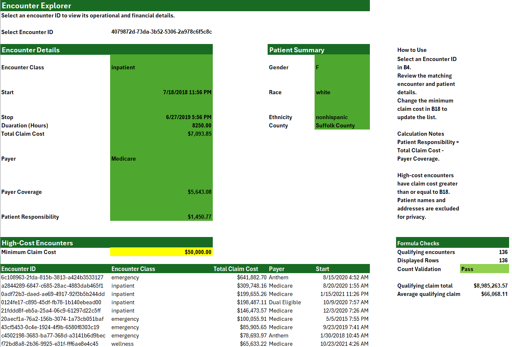

# Hospital Operations and Patient Care Analysis

An end-to-end Microsoft Excel portfolio project analyzing hospital utilization, encounter costs, insurance coverage, repeat inpatient use, and procedure activity. The workbook combines Power Query, the Excel Data Model, formulas, PivotTables, PivotCharts, slicers, validation checks, and an interactive dashboard.

[Download the completed Excel workbook](workbook/hospital_operations_analysis.xlsx)

## Dashboard



The dashboard summarizes 27,891 encounters from January 2011 through February 5, 2022. Year, encounter-class, and payer slicers allow the results to be explored interactively. Because 2022 contains only partial data, it is not treated as a complete year in trend comparisons.

## Business Questions

- How has encounter volume changed over time?
- Which encounter classes account for the most activity and claim cost?
- How do inpatient duration and repeat inpatient use behave?
- How much recorded claim cost is covered by payers?
- Which procedures drive volume, total spending, and average cost?
- Which operational patterns warrant additional review?

## Dataset and Data Model

The project uses the synthetic [Hospital Patient Records dataset](https://mavenanalytics.io/data-playground/hospital-patient-records) from Maven Analytics. The raw CSV files remain unchanged in `data/raw/`.

| Table | Rows | Grain |
|---|---:|---|
| Patients | 974 | One row per patient |
| Encounters | 27,891 | One row per encounter |
| Procedures | 47,701 | One row per procedure record |
| Payers | 10 | One row per payer |
| Organizations | 1 | One row per organization |

The relational model keeps encounter measures and procedure measures at their original grains. This prevents procedure-level rows from duplicating encounter-level claim costs.



## Headline Results

| Metric | Result |
|---|---:|
| Total encounters | 27,891 |
| Unique patients | 974 |
| Total claim cost | $101.5 million |
| Recorded payer coverage | $31.1 million |
| Weighted payer coverage rate | 30.6% |
| Procedure records | 47,701 |

## Key Findings and Recommendations

| Finding | Evidence | Operational recommendation |
|---|---|---|
| Ambulatory care drove overall utilization and the February 2014 spike. | Ambulatory encounters represented 44.9% of encounter volume and increased from 69 in January 2014 to 930 in February. | Monitor monthly encounter exceptions by class, patient frequency, and procedure description. |
| Inpatient activity included a small long-stay tail. | 1,077 of 1,135 inpatient encounters lasted 24 hours or less, while 17 exceeded seven days. | Review unusually long stays together with encounter reasons and visit history. |
| Repeat patients accounted for most inpatient encounter volume. | 72 of 153 inpatient patients had multiple encounters and generated 1,054 of 1,135 inpatient encounters. | Review repeat utilization and visit intervals without labeling the result a formal readmission rate. |
| Cost intensity differed substantially by encounter class. | Ambulatory care generated the largest total claim cost, while inpatient encounters had the highest average claim cost at $7,761.35. | Evaluate high-cost services using both total volume and average cost. |
| Zero recorded payer coverage was common. | 13,586 encounters had zero recorded coverage, representing 48.7% of encounters and 62.2% of total claim cost. | Audit registration, payer mapping, and coverage-data capture. |
| Electrical cardioversion was the largest procedure spending driver. | 1,383 procedure records generated $35.8 million in base cost. | Validate whether the spending is concentrated by patient or year before using it for planning. |

## Encounter Explorer

The workbook includes an interactive encounter-level view driven by a validated encounter-ID selector. It displays operational and financial details, calculates patient responsibility, identifies high-cost encounters, and excludes patient names and street addresses from the public-facing view.



## Excel Skills Demonstrated

- Power Query imports, type handling, and data-quality queries
- Relational modeling with one-to-many relationships in Power Pivot
- DAX measures for counts, costs, coverage, and procedure analysis
- Formula-driven analysis using functions such as `XLOOKUP`, `COUNTIFS`, `FILTER`, `UNIQUE`, `SORT`, `LET`, and `IFERROR`
- PivotTables, PivotCharts, value filters, sorting, and slicers
- Interactive dashboard layout and KPI presentation
- Reconciliation checks across encounter, patient, payer, and procedure grains
- Privacy-minded public reporting

## Validation Approach

- Confirmed the grain and key fields of every source table before analysis.
- Tested primary-key uniqueness and foreign-key matches.
- Kept encounter claim cost separate from procedure base cost to avoid double counting.
- Reconciled headline totals across Power Query, the Data Model, formulas, and PivotTables.
- Added dedicated QA queries and formula checks.
- Tested dashboard slicers individually and in combination after **Refresh All**.

The completed workflow, calculation definitions, and validation steps are documented in [`docs/methodology.md`](docs/methodology.md).

## Important Limitations

- The dataset is synthetic, so the results demonstrate analytical methods rather than actual hospital performance.
- Data for 2022 ends on February 5 and should not be compared with complete years.
- Multiple inpatient encounters are described as repeat utilization, not formal clinical readmissions.
- Payer coverage represents recorded coverage values, not confirmed adjudicated payments.
- Long stays and low-frequency procedures can strongly affect averages.
- Encounter claim cost and procedure base cost use different grains and definitions and should not be added together.

## Repository Structure

```text
hospital-operations-excel-analysis/
├── data/raw/                         # Original source CSV files
├── docs/
│   └── methodology.md                # Completed Excel workflow and validation
├── images/                           # Portfolio screenshots
├── workbook/
│   └── hospital_operations_analysis.xlsx
└── README.md
```

## Using the Workbook

1. Download the repository and open `workbook/hospital_operations_analysis.xlsx` in desktop Microsoft Excel.
2. If necessary, update each Power Query source path so it points to the downloaded `data/raw/` folder.
3. Select **Data → Refresh All**.
4. Use the Dashboard slicers to explore the results.
5. Use the Encounter Explorer to inspect a synthetic encounter or change the high-cost threshold.

## Data Source

Maven Analytics Data Playground, [Hospital Patient Records](https://mavenanalytics.io/data-playground/hospital-patient-records). The source describes synthetic Massachusetts General Hospital records and lists the dataset as public domain.
